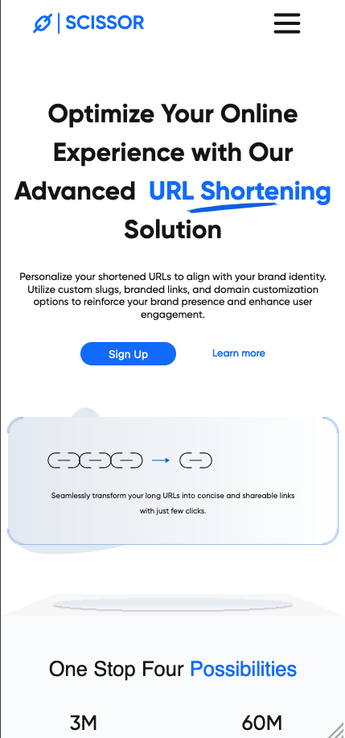

# Capstone Project | Scissors Web

### Overview:

The Scissors Web project is a testament to the principles of modern web development, featuring a sleek and intuitive user interface coupled with powerful functionality. From authentication to link management and analytics, every aspect of the application is designed to streamline the URL management process and empower users with actionable insights.

Whether you're a casual user looking to share links with friends or a business professional seeking to track link performance, the Scissors Web project offers a comprehensive solution tailored to your needs.

## Table of Contents

- [Features](#features)
- [Demo](#demo)
- [Dependencies](#dependencies)
- [Folder Structure](#folder-structure)
- [Contributing](#contributing)
- [Screenshot](#screenshot)
- [Built With](#built-with)
- [Earlier Version](#earlier-version)

## Features

#### Authentication:

- Implemented a secure authentication system to ensure user data privacy and access control.
- Users can securely log in and manage their shortened URLs within a personalized dashboard.

#### Link Shortening:

- Utilized advanced techniques, including use of emoji combinations, to provide unique and memorable shortened URLs.
- Users can effortlessly trim lengthy URLs into concise and visually appealing links, making sharing and managing links more engaging.

#### QR Code Generation:

- Integrated QR code generation functionality to allow users to generate QR codes for their shortened URLs.
- Enhances the usability of shortened URLs by enabling users to easily share and access links through QR codes, especially in mobile environments.

#### Analytics:

- Implemented analytics features to provide users with insights into the performance of their shortened URLs.
- Users can track various metrics such as click counts, browser statistics, geographical distribution... to gain valuable insights into link engagement and audience behavior.

#### Error Boundary:

- Implemented error boundaries to enhance application robustness and provide a graceful fallback mechanism in case of unexpected errors.
- Ensures a smooth user experience by handling errors gracefully without disrupting the overall functionality of the application.

#### Theme Modes:

- Seamlessly integrates light and dark mode themes based on the user's device default settings.
- Offers users the flexibility to switch between light and dark modes directly from the user interface, providing a personalized browsing experience.

## Demo

You can try the app live at [Scissors Web](https://altschool-scissors.netlify.app/).

## Dependencies

- react
- @phosphor-icons/react
- @supabase/supabase-js
- file-saver
- react-router-dom

## Folder Structure

The project structure is organized as follows:  
public/: Contains the public assets.  
src/: Contains the source code of the application and all components  
src/components: Contains all component file.  
src/pages: Contains the Pages and their CSS styles.  
src/css: CSS styling for individual component.  
src/data: Contains data files used in some components.  
src/images: Contains images used in the App components.  
App.tsx: The main application component where routing is done.  
main.tsx: The root component file.  
package.json: Lists the project dependencies and scripts.  
index.html  
README.md/: The documentation file.  
...and others

## Contributing

Contributions are welcome! If you'd like to contribute to this project, please follow these steps:

    Fork the project.
    Create a new branch for your feature: git checkout -b feature-name.
    Make your changes and commit them: git commit -m 'Add some feature'.
    Push to the branch: git push origin feature-name.
    Submit a pull request.

## Screenshot

## Built with

- React
- Vanilla JavaScript
- TypeScript
- Semantic HTML5 markup
- CSS custom properties

## Earlier Version

Checkout earlier non-responsive design using just HTML and CSS in the  branch of this repo.
